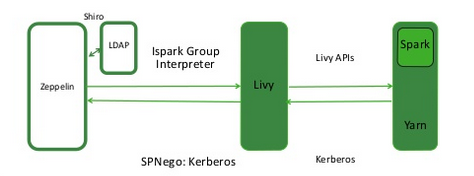

# Livy and Zeppelin for Cloudera Manager and CDH

This git repository is used to build both CSDs and parcels for CDH.

It can run multiple Livy instances (one for Spark and one for Spark2), and will run a Zeppelin instance that runs a Livy interpreter for each Livy instance and a markdown interpreter.

Both Livy and Zeppelin will run as services in Cloudera Manager, and their configuration is maintained through the CM web UI.

This will work in a secure (Kerberos-enabled) environment.

This has been tested on CDH 5.12.1.

## Build and Installation

Attached to the repository releases are prebuilt CSDs and Parcels for both Livy and Zeppelin.
You might be able to use the Github release URLs as parcel repositories in CM (e.g. `https://github.com/bushnoh/livy_zeppelin_cdh_csd_parcels/releases/download/Livy-0.4.0-v0.1/`) however I have not tested if this works. 

To build the CSDs and Parcels yourself, you can run the build script:

```
#Build the Parcel files, this make take some time
sh build.sh parcel

#Build the CSDs
sh build.sh csd
```

Information about installing custom services can be found at [https://www.cloudera.com/documentation/enterprise/latest/topics/cm_mc_addon_services.html](https://www.cloudera.com/documentation/enterprise/latest/topics/cm_mc_addon_services.html).

## Configuration

### Kerberos

Livy and Zeppelin can be configured to work in a secure environment using Kerberos:



Livy will talk to a secure cluster and proxy to the user provided by Zeppelin. Zeppelin will talk to Livy using SPNEGO and provide the logged-in user as a proxy user to Livy. As a result, the logged-in user will be the owner of the Spark application in YARN.

#### Livy Configuration
To set this up, enable both User Authentication (spnego) and Access Control in the Livy setting.

You will also need to set up `hadoop.proxyuser.livy.groups` and `hadoop.proxyuser.livy.hosts` in the HDFS core-site to allow Livy to proxy to users. You should limit this only to the groups that will be using Zeppelin and the host Livy is running on.

If you are using a KMS you will also need to add `hadoop.kms.proxyuser.livy.groups` and `hadoop.kms.proxyuser.livy.hosts` into the KMS proxy kms-site configuration.

#### Zeppelin Configuration

To configure Zeppelin to talk to a secure Livy instance, disable the Annonymous Allowed option and enable the Shiro Enabled option. Other configuration options such as disabling public notes and isolating the interpreter scope per user should also be considered along with SSL encryption to prevent login credentials being transfered in plaintext.

Then provide a Shiro configuration into the shiro.ini safety valve. See section below for information.

### SSL

SSL can be enabled on the Zeppelin web UI using the standard CM configuration details.

There is also an option to enable SSL on Livy, however this hasn't been tested. Zeppelin authenticates with Livy using SPNEGO so credentials are not transfered between the two services.

### Shiro

When using authentication in Zeppelin you must provide your own Shiro configuration into the shiro.ini safety value.

The easiest option is to use PAM authentication, restricting access to Zeppelin to those users that can SSH to the machine:

```
# Sample configuration that uses PAM for login and allows users to restart interpreters
[users]

[main]
pamRealm=org.apache.zeppelin.realm.PamRealm
pamRealm.service=sshd
sessionManager = org.apache.shiro.web.session.mgt.DefaultWebSessionManager
securityManager.sessionManager = $sessionManager
securityManager.sessionManager.globalSessionTimeout = 86400000
shiro.loginUrl = /api/login

[roles]
role1 = *
role2 = *
role3 = *
admin = *

[urls]
/api/version = anon
/api/interpreter/setting/restart/** = authc
/api/interpreter/** = authc, roles[admin]
/api/configurations/** = authc, roles[admin]
/api/credential/** = authc, roles[admin]
/** = authc
```

## Tested

The following features are tested:
* Kerberos for Livy
* Kerberos for Zeppelin
* Shiro PAM authentication
* SSL on Zeppelin
* Hive context
* Spark and Spark2 (Hive on Spark 1.6 in cluster-mode doesn't work due to [this](https://issues.apache.org/jira/browse/SPARK-18160))
* Loading custom packages into Livy using `livy.spark.jars.packages`

The following features have not been tested:
* SSL on Livy for SSL communication between Zeppelin and Livy
